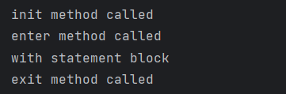

# File Handling
Often we need to work with files inside our program to read or to write and safe some information. For this purpose, we use file handling. At the end of this module, you will be able to work with files in different modes and use file and context managers.

Values of the variables are stored in the memory only during program runtime. Sometimes we have a need for long-term storage, and for that we can use files. 

```commandline
file = open("path_to_file/file_name.txt")
```
If a file is already existing it will be opened, otherwise a new file will be created.
```open()``` function can receive different modes of the work with file as the second parameter after file name. 

Here are file modes:

* r - reading (This is default mode. The file pointer is placed at the beginning of the file.)
* r+ - reading + writing 
* w - writing (Overwrites the file if the file exists or creates a new one)
* w+ - writing + reading (If file doesn't exist, it creates a new file)
* a - append (File pointer at the end of the file if the file exists. If the file does not exist, it creates a new file for writing)
* a+ - appending + reading
* rb - reading binary format 
* wb - writing binary format
* ab - appending binary format
* rb+ - reading and writing binary format 
* wb+ - writing and reading binary format 
* ab+ - appending and reading binary format 
* x - open for exclusive creation (Failing if the file already exist)

Let's look at the first example. Consider we have "greetings.txt" text file that contains the following data:


We can open this file as follows:
```
file = open("greetings.txt")
```
While we didn't specify any mode, the file was opened in the default ```tr``` (read text file mode).

```text
file = open("greetings.txt", "r")
```
Now the file was opened in the read mode.

#### Good practice is too close file when we finished work with file by built-in close() method.
```text
file = open("greetings.txt", "r")

file.close()
```
### Reading
```text
file = open("greetings.txt", "r")

print(file.read())
# Hello, world!
# Salut!
# Hola!

file.close()
```
If to pass a numeric argument to the read method, it will return the specified number of characters from the file:
```text
file = open("greetings.txt", "r")

print(file.read(10)) # Hello, wor

file.close()
```
To read file line by line, need to create loop and use ```readline()``` or ```readlines()``` methods. 
The ```readline()``` method return a line string and ```readlines()``` return list of all lines.
```text
file = open("greetings.txt", "r")

print(file.readline())
# Hello, world!
print(file.readline())
# Salut!

file.close()
```

To start reading not from the beginning, use the ```seek()``` method and pass as the argument number of skipped symbols. ```seek()``` method moves the file pointer to the defined position. 
```text
file = open("greetings.txt", "r")

file.seek(10)
print(file.read())
# ld!
# Salut!
# Hola!

file.close()
```
When we are using ```readline()``` method the file pointer moving line by line and when we reached the end of file we will continue to receive empty lines. To move file pointer to the beginning of the file use ```seek()``` method without any arguments.
```text
file = open("greetings.txt", "r")

print(file.readlines())
# ['Hello, world!\n', 'Salut!\n', 'Hola!\n']

file.close()
```

And one more example with ```readlines()``` and ```for ``` loop:

```text
file = open("greetings.txt", "r")

for line in file.readlines():
    print(line, end="")
    
# Hello, world!
# Salut!
# Hola!

file.close()
```
```end=""``` argument define separator between lines, default meaning is a line break ```\n``` .

The main difference between ```read()``` and ```readlines()``` methods is that the difference in the memory use. If the file huge, it`s better to proceed line by line at one moment with readlines() method but not whole file, as with the read() method.

### Writing

To write to a file use the ```w``` - write mode.
As an argument to a ```write()``` method only string can be passed.
```text
file = open("greetings.txt", "w")

file.write("Bonjour!")

file.close()
```
Our already existing file will be overwritten.


### Appending mode

If needed to continue existing document we have to use appending mode. The file pointer is in the end of file. Pay attention to the EOL (End of Line) symbol. Remember, that after write mode we have overwritten the file and there is only "Bonjour!" sentence.
```
file = open("greetings.txt", "a")

file.write("\nHello!")

file.close()
```
Output:


### Context Manager

Python language is optimized and if we forget to ```close()``` the file it will be closed at the end of program running. But it's not the best practice. For the purpose not to forget to close we can use ```with``` statement or File manager.

```text
with open("greetings.txt", "r") as file:
    print(file.read())
```
The ```with```statement equivalent to the commands bellow: 
```text
file = open("greetings.txt", "r")

print(file.read())

file.close()
```
But if some error raise before the ```file.close()``` command the file will remain open otherwise ```with``` statement will close file any way. Here is some examples:
```
file = open("greetings.txt", "r")
1//0
print(file.read())
file.close()
```
```text
file.closed # False
```
While
```text
with open("greetings.txt", "r") as file:
    1//0
    print(file.read())
```
```text
file.closed # True
```
The work of the ```with``` is equivalent to:
```text
file = open("greetings.txt", "r")
try:
    print(file.read())
finally:
    file.close()
```
Important! We can use Context Manager not only with files.

#### Implementing a custom Context Manager

* The Context Manager always contains two special methods: ```__enter__``` and ```__exit__```
* The ```__enter__``` methods returns an object assigned to a variable after the ```as``` keyword. The default value is ```None```.
* If an error occurs in ```__init__``` or ```__enter__```, then the code block is never executed and the ```__exit__``` is not called.
* After running a block of code, the ```__exit__``` is always called, even if an exception occurs in it.
```text
class ContextManager:
    def __init__(self):
        print("init method called")
        
    def __enter__(self):
        print("enter method called")
    
    def __exit__(self, exc_type, exc_value, exc_traceback):
        print("exit method called")        
```
Just by defining ```__enter__``` and ```__exit__``` methods we can use our new class in a ```with``` statement.
```text
with ContextManager() as manager:
    print("with statement block")
```
Output:


Now, let's implement a custom File manager. 
```text
class CustomFileManager:
    def __init__(self, filename, mode):
        self.filename = filename
        self.mode = mode
        self.file = None
    
    def __enter__(self):
        self.file = open(self.filename, self.mode)
        return self.file
    
    def __exit__(self, exc_type, exc_value, exc_traceback):
        print("Exception has been handled")
        self.file.close()
```
Let's try to handle exception inside ```with``` statement.
```text
with CustomFileManager("greetings.txt", "r") as file:
    1 // 0
    file.read()
```
The file wasn't read because of raised ZeroDivisionError before call of the ```read()``` method. However, file is closed and Output: ```Exception has been handled``` is printed. 
```text
file.closed # True
```

We can also implement Context Manager using generators and decorators. For this python has a ```contextlib``` module where we import ```contextmanager```.

```text
from contextlib import contextmanager

@contextmanager
def open_file(name, mode):
    file = open(name, mode)
    try:
        yield file
    finally:
        file.close()
```
* Due to the decorator, contextmanager is called with the function name ```open_file```.
* Python creates a generator instead of a normal function because of encounted ```yield``` keyword.

```text
with open_file("greetings.txt", "a") as file:
    file.write("Hola!")
```
